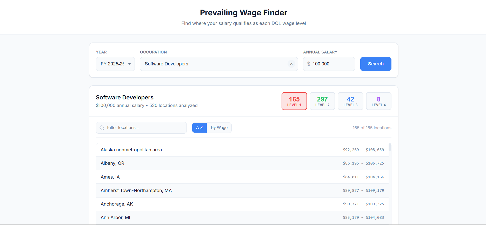

# DOL Prevailing Wage Finder

Find locations where your salary qualifies as each DOL prevailing wage level. Useful for H-1B, PERM, and immigration wage planning.



## Features

- Search by occupation (SOC code or job title)
- Enter your annual salary
- See all locations categorized by wage level (1-4)
- Pre-loaded with official DOL OFLC data for multiple fiscal years
- Mobile-responsive design

## Live Demo

[View the app](https://revanth-guduru-balaji.github.io/Wage-Finder/)

## Development

```bash
# Install dependencies
npm install

# Start development server
npm run dev

# Build for production
npm run build

# Preview production build
npm run preview
```

## Updating Wage Data

1. Download the latest OFLC wage data from [flag.dol.gov/wage-data](https://flag.dol.gov/wage-data/wage-data-downloads)
2. Place the `.zip` file in the project root
3. Run `npm run preprocess`
4. The new data will be added to `public/data/`

## Deployment to GitHub Pages

1. Update `homepage` in `package.json` with your GitHub username and repo name
2. Run `npm run deploy`

Or manually:

1. Run `npm run build`
2. Push the `dist` folder contents to your `gh-pages` branch

## Data Source

Prevailing wage data from the [DOL Office of Foreign Labor Certification (OFLC)](https://flag.dol.gov/wage-data).

## License

MIT

